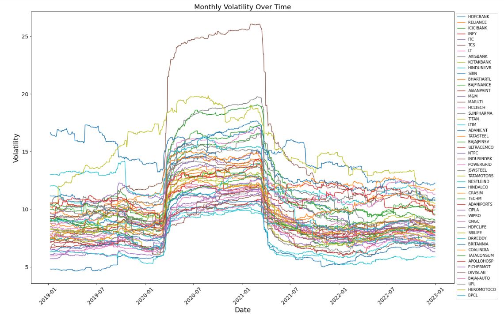
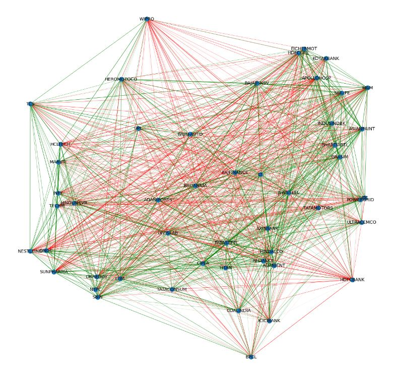
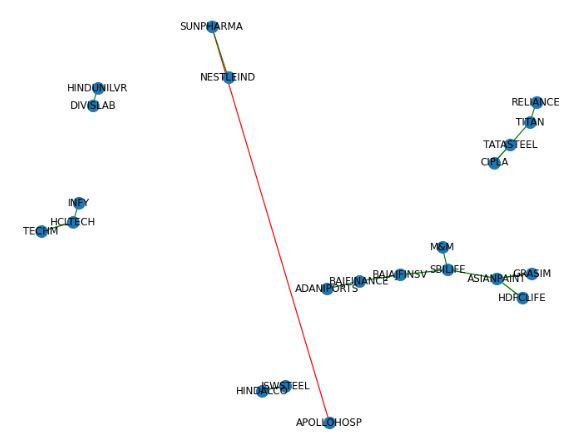
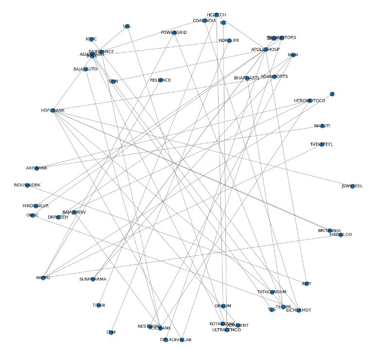
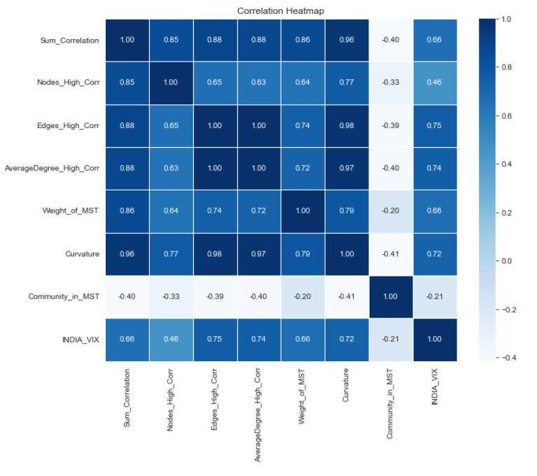

# Network Graph as Market Stability Indicator

_Referred a Research Paper, took the idea and combined with own thoughts to create a Quantitative Risk Indicator_

[Check the referred Research Paper](https://drive.google.com/file/d/1aM9srn0hMbaXMF6aUzEiJz_zFFp1LS3V/view?usp=drive_link)

### The idea and further findings

- The research paper suggested that curvature of discrete network graph can serve as an indicator of market stability.

- Upon experimenting, the result came that various properties of graph change with the changing market condition. 

- Properties such as Average Degree in high correlation graph, Cost Function of of minimum spanning tree, number of communities in high correlation graph, etc can all serve as good market risk indicators. 

- Hence a network graph formed by correlation pairs of stocks can inherently tell us about Market Stability or alternatively Market Fragility

### Tested Properties of Network Graph

| Sr. | Network Graph Property                   |The idea of how it should be related to market risk            |
| --- | -----------------------------------------|---------------------------------------------------------------|
| 1.  | Sum of Correlations                      |Higher correlation sums indicate greater market risk, as most stocks tend to move similarly in such periods, stocks generally exhibit more positive correlations.|
| 2.  | Number of Nodes in High Correlation Graph| When filtering the graph to include only nodes and edges displaying high correlations, an abundance of nodes with predominantly positive correlations suggests market turbulence. Whether considering positive or negative correlations, an increased number of nodes in such a graph indicates heightened market activity with strongly correlated movements.|
| 3.  | Edges in High Correlation Graph          |Using the same logic as the number of nodes in a high correlation graph, an increased number of connections among stocks within this graph suggests the emergence of stronger connections that were not as pronounced before. This points to the potential for market turbulence.|
| 4.  | Average degree in High Correlation Graph  |The idea behind point 2 and point 3 can be consolidated and can be tracked by this single property.|
| 5.  | Number of Communities in High Correlation graph |In times of instability, most stocks tend to exhibit similar behavior, leading to a decrease in the number of communities. However, this reduction in community numbers can also signify a strong market rally.|
| 6.  | Cost Function of Minimum Spanning Tree     |As stocks tend to move toward more positive correlations during market instability, it's expected that the cost in the minimum spanning tree will naturally increase.|
| 7.  | Curvature of Discrete Network graph      |This property is what research paper suggested would change with changing market conditions.|

## Screenshots

  
  
  
  
  

